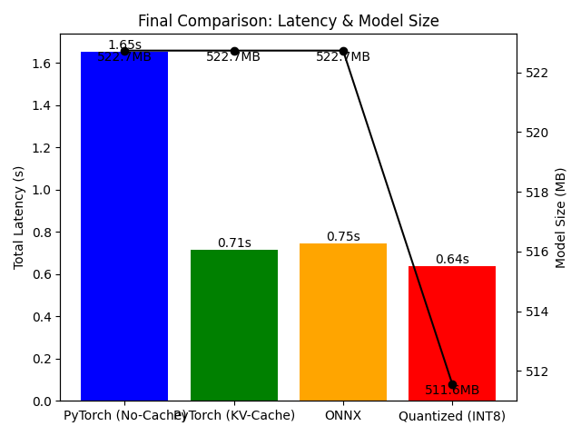

# LLM Inference Profiling & Optimization


## Executive Summary

Achieved up to **2.6x speedup** on GPT-2 inference using Quantization and ONNX optimization. This project demonstrates systematic performance engineering for LLMs, including baseline, KV-Cache, ONNX, and INT8 quantization.

---

## Key Results

| Method         | Latency (50 tokens) | Speedup | Model Size |
|----------------|---------------------|---------|------------|
| Baseline       | 1.65s               | 1.0x    | 522MB      |
| KV-Cache       | 0.71s               | 2.3x    | -          |
| ONNX           | 0.75s               | 2.2x    | -          |
| INT8 Quant     | 0.64s               | 2.6x    | 511MB      |

---

## Final Comparison



---

## Quick Start

```bash
# 1. Clone and enter the repo
git clone https://github.com/DS-Jerry-in-Taiwan/llm-inference-profiling-optimization.git
cd llm-inference-profiling-optimization

# 2. (Optional) Create and activate a virtual environment
python3 -m venv venv
source venv/bin/activate

# 3. Install dependencies
pip install -r requirements.txt

# 4. Run environment check (optional, recommended)
python setup_check.py

# 5. Run baseline experiment
python src/baseline.py

# 6. Run ONNX optimization
python src/optimize_onnx.py

# 7. Run quantization experiment
python src/optimize_quantization.py

# 8. View results (charts and JSON)
ls results/charts/
ls results/*.json

# 9. Open charts (example)
# On Linux/macOS:
xdg-open results/charts/final_comparison.png
# On Windows:
start results/charts/final_comparison.png
```

---

## Project Structure

- `src/` - All experiment scripts (with docstrings and comments)
- `results/` - JSON metrics and charts
- `models/` - Downloaded and quantized model files
- `docs/` - Technical methodology and deep dives
- `notebooks/` - Jupyter analysis (optional)

---

## Documentation

See [docs/methodology.md](docs/methodology.md) for technical details on KV-Cache, ONNX, and Quantization.

---

## License

MIT License
